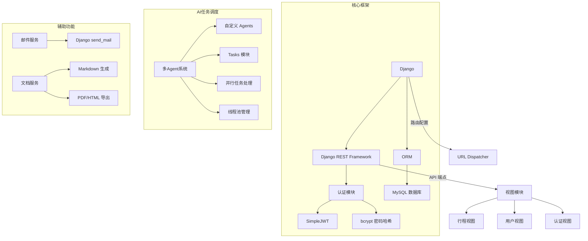

```mermaid
graph TD
    %% 核心框架
    subgraph 核心框架
        A[Django]
        B[Django REST Framework]
        C[认证模块]
        C1[SimpleJWT]
        C2[bcrypt 密码哈希]
        D[ORM]
        D1[MySQL 数据库]
        A --> B
        B --> C
        C --> C1
        C --> C2
        A --> D
        D --> D1
    end

    %% AI任务调度
    subgraph AI任务调度
        E[多Agent系统]
        E1[自定义 Agents]
        E2[Tasks 模块]
        E3[并行任务处理]
        E4[线程池管理]
        E --> E1
        E --> E2
        E --> E3
        E --> E4
    end

    %% 辅助功能
    subgraph 辅助功能
        F[邮件服务]
        F1[Django send_mail]
        G[文档服务]
        G1[Markdown 生成]
        G2[PDF/HTML 导出]
        F --> F1
        G --> G1
        G --> G2
    end

    %% 路由与视图
    A -->|路由配置| H[URL Dispatcher]
    B -->|API 端点| I[视图模块]
    I --> J[行程视图]
    I --> K[用户视图]
    I --> L[认证视图]
```